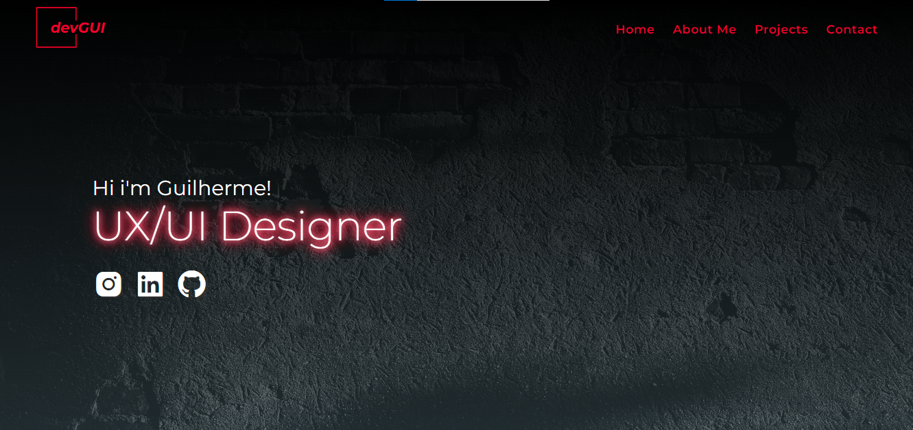

<h1 align="center">Personal Portfolio</h1>

---

 

  

---
## Technologies

This project was developed with the following tecnologies:

- HTML5
- CSS3
- Javascript
- Git and Github

---

## Project

This project aims to promote my freelance website and showcase my professional portfolio to potential clients and employers interested in my services. The goal is to highlight my skills, experiences, and previous projects.

Link for the Website: [Personal Portfolio](https://guimendessantos.github.io/PortfolioGui/HTML/index.html)

--- 
